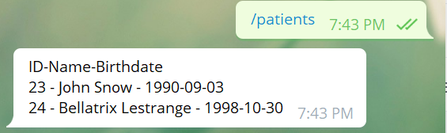
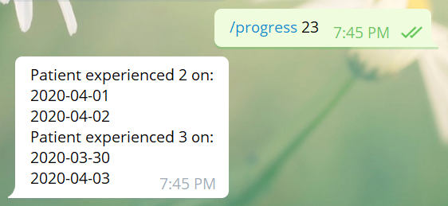
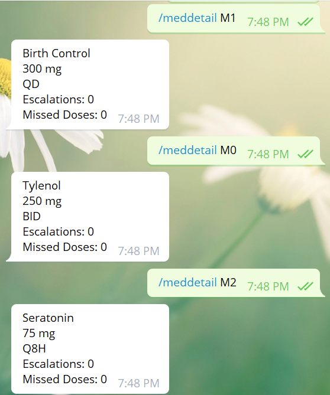
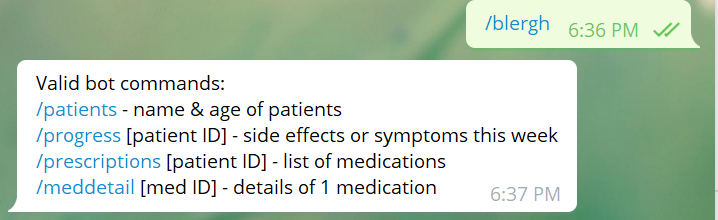

Bot Name: Medication Bot
Username: @MedDispenserBot

About: The Medication Dispenser Bot helps keep track of patients' medication Intake and daily progress

Install: $ pip install python-telegram-bot --upgrade

Find it at: t.me/MedDispenserBot

Logo: botlogo.jpg

Token: in telegramtoken.txt file

API: https://core.telegram.org/bots/api

https://python-telegram-bot.readthedocs.io/en/latest/telegram.html

Bot Commands:

