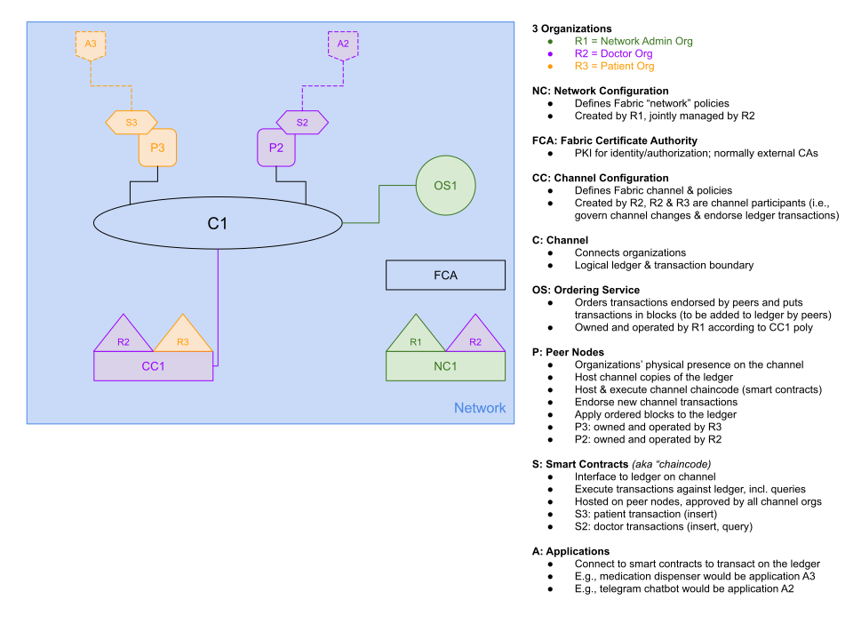

## Project Progress - Matt Boyd  
Weekly Progress:
* [4/13/20](#041320)
* [4/6/20](#040620)
* [3/30/20](#033020)
* [3/23/20](#032320)

---

<a name="041320"/>

### Week ending 4/13/20
__Tasks completed__ this week:

- Hyperledger Fabric:
	- [x] Setup NodeJS-based application to call Hyperledger code (to query blockchain)

- NodeJS (Other):
	- [x] Add code to receive POST calls from Telegram for data requests from doctor(s)
	- [x] Connect POST requests to Hyperledger queries to return requested data from blockchain
	- [x] Setup AWS Javascript SDK to connect to AWS Lambda  
	- [x] Add code to return data from Hyperledger queries to Lambda directly (rather than API requests) 
	- [x] Setup all network pass-throughs to allow POSTs from Lambda to connect directly to NodeJS running locally on my VM

__Tasks outstanding:__
- NodeJS:
	- [ ] Setup NodeJS-based scheduling process for alerts

---

<a name="040620"/>

### Week ending 4/6/20
__Tasks completed__ this week:

- Hyperledger Fabric:
	- [x] Setup custom network for our scenario
	- [x] Add example patient medication records to blockchain 
	- [x] Setup sample code to query and update records on blockchain

- Twilio & Lambda:
	- [x] Setup Twilio developer account and phone number
	- [x] Setup AWS account  
	- [x] Setup and test Lambda code to send SMS via Twilio 
	- [x] Setup and test Lambda code to make calls with computer-generated audio via Twilio

__Tasks outstanding:__
- Hyperledger Fabric:
	- [ ] Setup NodeJS-based application to call Hyperledger code (to query and update blockchain)

---

<a name="033020"/>

### Week ending 3/30/20
__Tasks completed__ this week:

- Hyperledger Fabric:
	- [x] Go through official [Hyperledger Fabric Developing Applications guide](https://hyperledger-fabric.readthedocs.io/en/latest/developapps/developing_applications.html)
	- [x] Go through official [Hyperledger Fabric Tutorials](https://hyperledger-fabric.readthedocs.io/en/latest/tutorials.html)\
	- [x] Permissions, roles, organizations, peers, and other Fabric parameters defined

- Hardware:
	- [x] Setup dynamic dns service to point to router
		- [x] ec544.hopto.org
	- [x] Configure router to route external port to internal device 
		- *NOTE: Internal IP addresses will be determined when devices added to network*
		- [x] RPi running Node: ec544.hopto.org:7776 -> 192.168.2.x:3100
		- [x] VM running Hyperledger Fabric: ec544.hopto.org:7786 -> 192.168.2.x:3100

__Tasks outstanding:__
- Hyperledger Fabric:
	- [ ] Custom network and peers setup for our scenario
	- [ ] Able to store patient medication data in Hyperledger Fabric
	- [ ] Able to query patient medication data from Hyperledger Fabric CLI

---

<a name="032320"/>

### Week ending 3/23/20
__Tasks completed__ this week:

- Hyperledger Fabric:
	- [x] Go through official [Hyperledger Fabric Introduction](https://hyperledger-fabric.readthedocs.io/en/latest/whatis.html)
	- [x] Go through official [Hyperledger Fabric Key Concepts](https://hyperledger-fabric.readthedocs.io/en/latest/key_concepts.html)
	- [x] Create initial design for our Hyperledger network (see diagram below)
	- [x] Go through official [Hyperledger Fabric Getting Started guide](https://hyperledger-fabric.readthedocs.io/en/latest/getting_started.html)
	- [x] Install primary Hyperledger Fabric components in VM
		- [x] Setup new Ubuntu VM to host Hyperledger Fabric
		- [x] Install all prerequisites (Git, cURL, Docker, Go, Node.js)
		- [x] Install Hyperledger Fabric v2.0 latest stable code
		- [x] Setup 3 node "test network" (in single VM) and test functionality
- Hardware:
	- [x] Purchased and received Google AIY Voice kit

__Tasks outstanding:__
- Hyperledger Fabric:
	- [ ] Go through official [Hyperledger Fabric Developing Applications guide](https://hyperledger-fabric.readthedocs.io/en/latest/developapps/developing_applications.html)
	- [ ] Go through official [Hyperledger Fabric Tutorials](https://hyperledger-fabric.readthedocs.io/en/latest/tutorials.html)
- Hardware:
	- [ ] Configure router to route external port to internal device
		- [ ] RPi running Node
		- [ ] VM running Hyperledger Fabric

__Hyperledger Fabric Network Design:__

